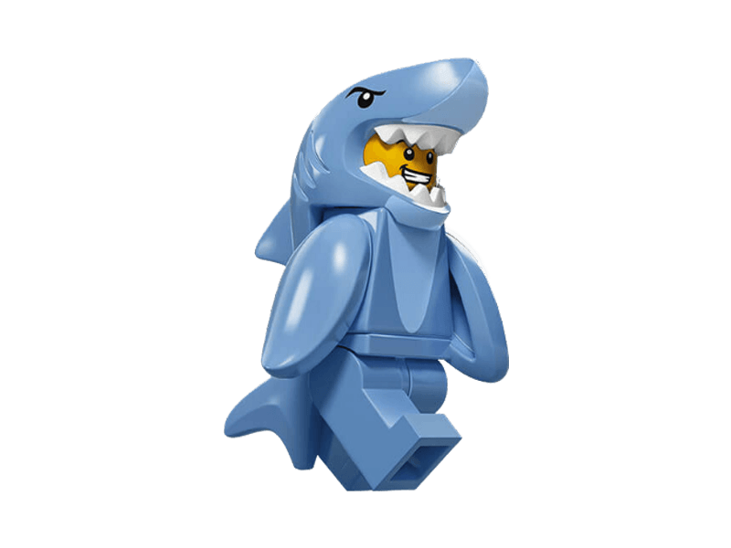
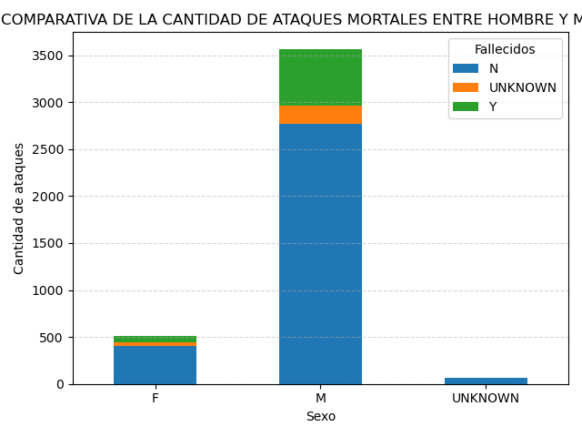
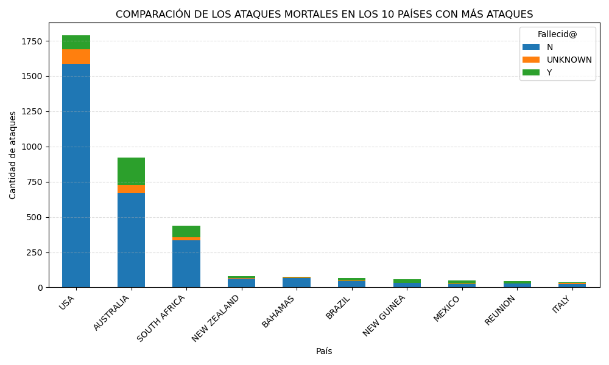
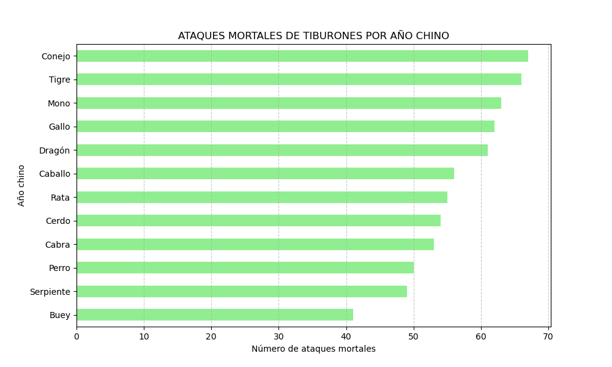

# EL TIBURÓN, ¿EL MEJOR AMIGO DEL SER HUMANO?

Desde pequeño he creído que el mar era un lugar donde podemos encontrar paz, armonía y ese momento de respiro que nos lleva a ver el día de una nueva forma. Pues después de analizar el dataframe de shark-attacks creo que cambio de opinión.

Empiezo por el principio, una vez limpiado el dataframe hemos creado 3 hipótesis que no ayudan a ver el mar como un lugar lleno de paz y armonía, nuestro amigo el tiburón no nos va a ayudar en este proceso.

Después estás líneas, vamos a pasar a ver nuestras hipótesis.

## Hipótesis 1: La primera hipótesis que planteo es que al tiburón creo que les gusta más la carne de hombre que la de mujer. ¿Qué pensáis?¶

Mis primeros temores empiezan a refrendarse, he querido valorar que tal predilección tiene el tiburón por el querer atacar a un hombre que a una mujer, siempre la guerra de sexos, no sé por qué me meto en este jardín. He realizado una comparativa de la cantidad de ataques entre hombres y mujeres y donde está mi sorpresa que efectivamente tiene predilección por los hombres, dentro de lo malo, es que hay muchos más ataques que no acaban en un final fatal respecto a los que sí.

## Hipótesis 2: La segunda hipótesis que planteo es: Creo que entre los 10 países dónde más ataques se producen no habrá ninguno Europeo. ¿Vamos a averiguarlo?

Este resultado me alivia algo. Solo Italia, aparece en el TOP10 de los países en todo el mundo que hay más ataques, por suerte he estado una única vez, y si estoy aquí es que no me han atacado.

¡En el TOP3 de este gráfico, tenemos en tercer puesto South Africa, en el segundo puesto Australia y en el primer puesto a USA, que como siempre en todo tienen que ser los mejores! La mejor liga de Baloncesto, la super bowl, etc.

## Hipótesis 3: Creo que animal del año chino que tiene más influencia en el tiburón para que sea más agresivo y, por lo tanto, en ese año haya más ataques mortales, es el Mono (apuesta de 'S'). ¿Cuál es vuestra apuesta?

Que tiene que ver esta hipótesis con las otras dos, nada creo yo, pero fue la primera que me vino a la cabeza, la deseche porque creía que me iba a consumir mucho tiempo, pero cada día que pasaba me intrigaba más saber cuál sería el resultado de este estudio, así que después de que 'S' me hiciera su predicción, no tuve más remedio que ponerme manos a la obra.

Para llevar a cabo esta hipótesis he creado una nueva columna en dataframe que relacione el año chino con el año correspondiente al cada ataque a través de un magnífico diccionario.

¿Queréis saber los que hay? Rata, Buey, Tigre, Conejo, Dragón, Serpiente, Caballo, Cabra, Mono, Gallo, Perro, Cerdo

¡Pues cuál ha sido mi sorpresa!!

'S', ¡no tenía razón, el animal que tiene más ascendencia sobre la agresividad del tiburón y convierta sus ataques en mortales es el CONEJO! Pues sí ese inocente animalito que posiblemente hayáis podido tener de mascota...

Ahora bien el Mono, es el tercero así que 'S' no iba tan desencaminada. Mi apuesta era el Dragón, pero no la he acertado.

Después de estas 3 hipótesis, tengo claro que ir al mar para relajarme y desconectar es una cosa que tengo que valorar muy bien, pero si no salgo de mi país y el año en el que estamos no es el del conejo, aun siendo hombre, creo que puedo valorar acercarme a la Barceloneta.

Ha sido un reto enfrentarme solo a este primer proyecto. Aún me queda muchísimo que aprender, mucho que mejorar y el síndrome de la hoja en blanco es menos síndrome después de este primer paso.